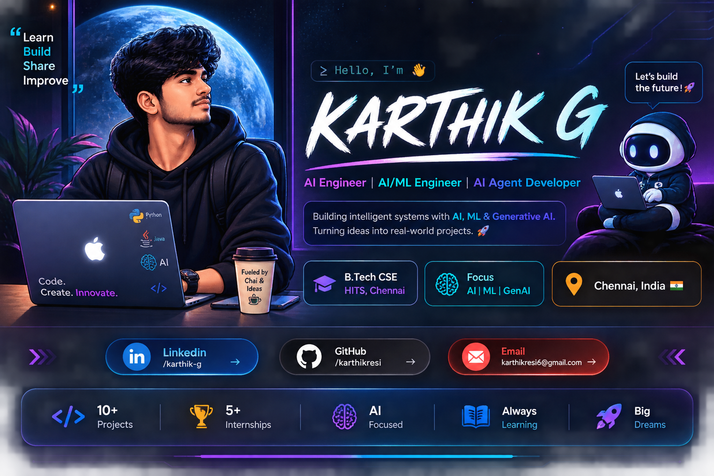

<div align="center">



</div>

---

<h2 align="center">👨‍💻 About Me</h2>

```yaml
name: Karthik G
education: B.Tech - Computer Science and Engineering
college: Hindustan Institute of Technology and Science, Chennai
cgpa: 9.13 / 10.0

role:
  - AI Engineer
  - AI/ML Engineer
  - Generative AI Engineer
  - AI Agent Developer

focus:
  - Artificial Intelligence
  - Machine Learning
  - Generative AI
  - NLP
  - AI Agents

currently_learning:
  - RAG & LLM Applications
  - AI Agent Development
  - LangChain & LangGraph
  - AI Automation

mindset: Learn → Build → Share → Improve
```

AI-focused Computer Science undergraduate passionate about building practical and intelligent applications using **Machine Learning, NLP, Generative AI, RAG, and AI Agents**.

I enjoy transforming ideas into **real-world AI-powered solutions** and continuously exploring new technologies in Artificial Intelligence and automation.

---

<h2 align="center">🧠 What I Do</h2>

<div align="center">

| 🤖 Artificial Intelligence | 🧠 Machine Learning | ✨ Generative AI |
| :---: | :---: | :---: |
| AI Agents | NLP | RAG & LLMs |
| Intelligent Applications | Predictive Analytics | Semantic Search |

</div>

---

<h2 align="center">🛠️ Tech Stack</h2>

### 💻 Programming Languages

<p align="left">

</p>

`Python` `Java` `C` `C++` `SQL` `JavaScript`

### 🤖 AI / Machine Learning

<p align="left">

</p>

`TensorFlow` `Keras` `Scikit-learn` `NLP` `Machine Learning`

### ✨ Generative AI

`Generative AI` `RAG` `LLMs` `AI Agents` `Prompt Engineering`

`LangChain` `LangGraph` `Embeddings` `Vector Databases` `Semantic Search`

### 🌐 Web Development

<p align="left">

</p>

`HTML` `CSS` `JavaScript` `Flask`

### ⚙️ Backend & Database

<p align="left">

</p>

`Spring Boot` `MySQL` `Firebase` `REST APIs`

### 📊 Data Science

`Pandas` `NumPy` `Matplotlib` `Seaborn`

### 🔧 Tools & Automation

<p align="left">

</p>

`Git` `GitHub` `VS Code` `Google Colab` `n8n`

---

<h2 align="center">🚀 My Learning Journey</h2>

<div align="center">

```text
                COMPUTER SCIENCE
                       ↓
                  PROGRAMMING
                       ↓
              DATA SCIENCE & ML
                       ↓
                     NLP
                       ↓
              GENERATIVE AI
                       ↓
                  RAG & LLMs
                       ↓
                  AI AGENTS
                       ↓
           REAL-WORLD AI SYSTEMS
```

</div>

### 🔭 Currently Exploring

- 🤖 AI Agent Development
- 🧠 Generative AI & LLM Applications
- 🔎 Retrieval-Augmented Generation (RAG)
- 🔗 LangChain & LangGraph
- ⚡ AI Automation with n8n
- 🧩 Intelligent Application Development

---

<h2 align="center">🌟 Featured Projects</h2>

### 🚨 AI-Powered Smart Emergency Response & Adaptive Community Dispatch System

An AI-powered emergency response platform designed to support intelligent community assistance using **AI/ML, predictive analytics, NLP, and dynamic-radius optimization**.

**Tech Stack**

`Python` `AI/ML` `NLP` `Predictive Analytics`  
`Dynamic Radius Optimization` `Java` `Spring Boot` `MySQL` `REST APIs`

---

### 📚 AI PDF Knowledge Assistant

A Generative AI-powered knowledge assistant that enables users to interact with documents using **RAG, LLMs, document processing, embeddings, vector databases, and semantic search**.

**Tech Stack**

`Python` `Generative AI` `RAG` `LLMs`  
`Document Processing` `Embeddings` `Vector Database` `Semantic Search`

---

### 🔐 Secure Vault — Mobile Security System

A mobile security application designed for secure storage of private photos and videos using **AES-256 encryption** and Firebase.

**Tech Stack**

`Kotlin` `Firebase` `AES-256 Encryption`  
`Secure Photo & Video Storage` `Mobile Development`

---

### 🛒 Fresh-Veg — E-Commerce Grocery App

An e-commerce grocery application focused on **real-time product and order management**.

**Tech Stack**

`Flutter` `Firebase` `E-Commerce`  
`Real-Time Product Management` `Order Management`

---

### 📖 AI Study Assistant

A Generative AI-based study assistant designed to help users interact with and learn from educational content.

**Tech Stack**

`Generative AI` `Python` `RAG` `LLMs`  
`PDF Processing` `Vector Database` `Semantic Search`

---

<h2 align="center">💡 Other AI Projects</h2>

<div align="center">

🤖 **Tic-Tac-Toe AI**  
🖼️ **Image Captioning**  
🎬 **Movie Recommendation System**  
👤 **Face Detection**  
💬 **NLP & Sentiment Analysis**  
🔢 **CNN Handwritten Digit Classification**

</div>

---

<h2 align="center">🏆 Achievements & Certifications</h2>

- 🎓 **Generative AI for Everyone** — DeepLearning.AI
- 🐍 **Python for Data Science, AI & Development** — IBM
- 🤖 **Amazon ML Challenge 2025** — Participant
- ✈️ **British Airways Data Science Job Simulation** — Forage
- 📊 **Tata Data Visualization: Empowering Business with Effective Insights** — Forage
- 💡 **Smart Product Pricing Challenge** — Participant
- 🚀 **Buildathon / NextWave** — Participant

---

<h2 align="center">📈 My AI Focus</h2>

<div align="center">

```text
       DATA
        ↓
   MACHINE LEARNING
        ↓
       NLP
        ↓
  GENERATIVE AI
        ↓
      RAG + LLM
        ↓
    AI AGENTS
        ↓
  AUTOMATION
        ↓
REAL-WORLD SOLUTIONS
```

</div>

---

<h2 align="center">🎯 Career Goal</h2>

<div align="center">

### Building intelligent systems that solve real-world problems.

**AI Engineer • AI/ML Engineer • Generative AI Engineer • AI Agent Developer**

</div>

---

<h2 align="center">🤝 Let's Connect</h2>

<p align="center">

<a href="YOUR_LINKEDIN_URL">

</a>

<a href="mailto:karthikresi6@gmail.com">

</a>

<a href="https://github.com/karthikresi">

</a>

</p>

---

<div align="center">

### 💻 Learn → Build → Share → Improve 🚀


</div>
